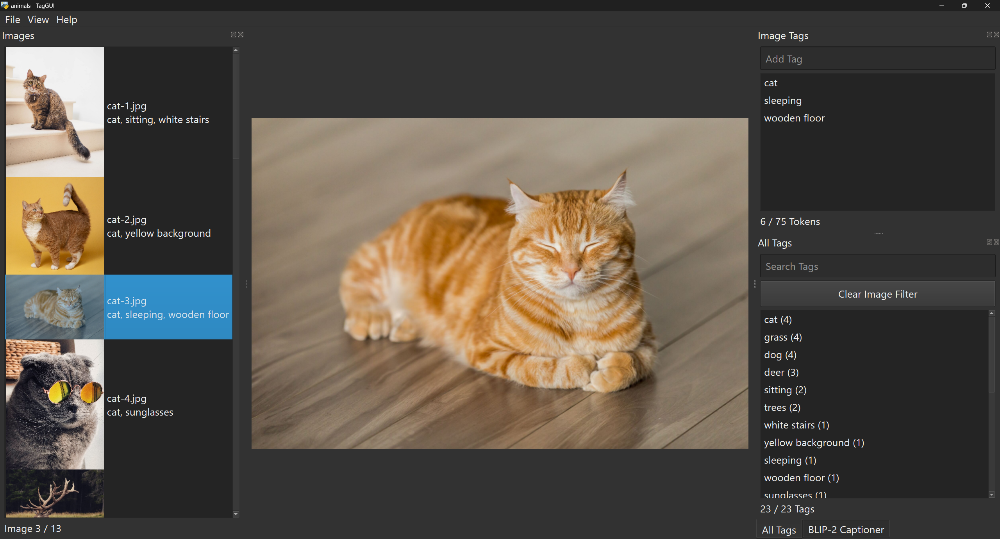

# TagGUI

Cross-platform desktop application for quickly tagging images, aimed towards
creators of image datasets for generative AI models like Stable Diffusion.
Written in Python using PySide6.

## Features

- Keyboard-friendly interface for fast tagging
- Tag autocomplete based on your own most-used tags
- Integrated Stable Diffusion token counter
- Batch tag renaming and deleting
- BLIP-2 caption generation
- Automatic dark mode based on system settings

## Installation

The easiest way to use the application is to download the latest release from
the [releases page](https://www.github.com/jhc13/taggui/releases).
Choose the appropriate file for your operating system, extract it wherever you
want, and run the executable file inside.
You will have to install [7-Zip](https://www.7-zip.org/download.html) to
extract the files if you don't have it on your system.
No additional dependencies are required.

Alternatively, you can install manually by cloning this repository and
installing the dependencies in `requirements.txt`.
Run `taggui/run_gui.py` to start the program.
Python 3.11 is recommended, but Python 3.10 should also work.

## Usage

Load the directory containing your images by clicking the `Load Directory`
button in the center of the window (or `File` -> `Load Directory`).
Tags are loaded from `.txt` files in the directory with the same names as the
images.
Any changes you make to the tags are also automatically saved to these `.txt`
files.

You can change the settings in `File` -> `Settings`.
Panes can be resized, undocked, moved around, or placed on top of each
other to create a tabbed interface.

## BLIP-2 Captioning (New in v1.2)

In addition to manual tagging, you can use the BLIP-2 model to automatically
generate captions for your images inside TagGUI.
GPU generation requires a compatible NVIDIA GPU, and CPU generation is also
supported.

To use the feature, select the images you want to caption in the image list,
then click the `Caption With BLIP-2` button in the BLIP-2 Captioner pane.
You can select a single image to get a caption for that image, or multiple
images to batch generate captions for all of them.
It can take up to several minutes to download and load the model when you first
use it, but subsequent generations will be much faster.

You can put some text inside the `Start caption with:` box to make the model
generate captions that start with that text.
For example, you can write `A photo of a person wearing` to get captions that
describe the clothing of the subject.
Additional generation parameters such as the minimum number of tokens and the
repetition penalty can be viewed and changed by clicking the
`Show Advanced Settings` button.
If you want to know more about what each parameter does, you can read the
[Hugging Face documentation](https://huggingface.co/docs/transformers/main/en/main_classes/text_generation#transformers.GenerationConfig).

## Controls

- Focus the image list: `Alt`+`L`
- Focus the `Add Tag` box: `Alt`+`A`
- Focus the `Search Tags` box: `Alt`+`S`
- Focus the `Caption With BLIP-2` button: `Alt`+`C`

### Images pane

- Previous / next image: `Up` / `Down` arrow keys
- First / last image: `Home` / `End`

### Image Tags pane

- Add a tag: Type the tag into the `Add Tag` box and press `Enter`
- Add the first tag suggested by autocomplete: Press `Ctrl`+`Enter`
- Delete a tag: Select the tag and press `Delete`
- Rename a tag: Double-click the tag, or select the tag and press `F2`
- Reorder tags: Drag and drop the tags
- Select multiple tags: Hold `Ctrl` or `Shift` while selecting the tags
- Previous / next image: `Up` / `Down` arrow keys while in the `Add Tag` box

### All Tags pane

- Show all images containing a tag: Select the tag
- Go back to showing all images: Click the `Clear Image Filter` button
- Delete all instances of a tag: Select the tag and press `Delete`
- Rename all instances of a tag: Double-click the tag, or select the tag and
  press `F2`
