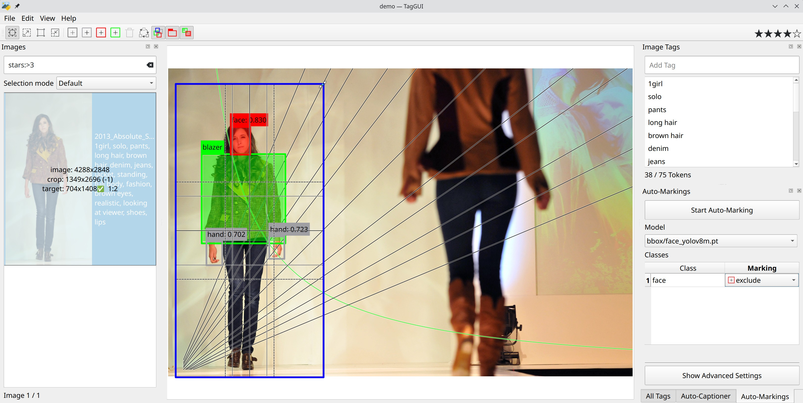

# TagGUI

Cross-platform desktop application for quickly adding and editing image tags
and captions, aimed towards creators of image datasets for generative AI
models.

## Features

- Keyboard-friendly interface for fast tagging
- Tag autocomplete based on your own most-used tags
- Integrated token counter (for Stable Diffusion)
- Automatic caption and tag generation with models including CogVLM, LLaVA, WD
  Tagger, and many more
- Batch tag operations for renaming, deleting, and sorting tags
- Advanced image list filtering
- Export images ready to be used for training
- Mark images manually or with the help of YOLO models to create masks for
  inclusion and exclusion of image parts for masked training
- Crop images with advanced hints that respect relevant aspect ratios and
  bucket sizes of the training scripts

## Installation

The easiest way to use the application is to download the latest release from
the [releases page](https://www.github.com/jhc13/taggui/releases).
Choose the appropriate file for your operating system, extract it wherever you
want, and run the executable file inside.
You may have to install [7-Zip](https://www.7-zip.org/download.html) to
extract the files if you don't have it on your system.

- macOS users: There is no macOS release because it requires a device running
  the OS, and I do not have one. You can still install and run the program
  manually (see below).
- Linux users: You may need to install `libxcb-cursor0`.
  (See [this Stack Overflow answer](https://stackoverflow.com/a/75941575).) You
  may also have to install `python3.12-dev` or `python3.11-dev` (depending on
  your Python version) if you get an error while trying to use a CogVLM2
  model. (See [this issue](https://github.com/jhc13/taggui/issues/234).)

Alternatively, you can install manually by cloning this repository and
installing the dependencies in `requirements.txt`.
Run `taggui/run_gui.py` to start the program.
Python 3.12 is recommended, but Python 3.11 should also work.

## Usage

Load the directory containing your images by clicking the `Load Directory`
button in the center of the window (or `File` -> `Load Directory`).
Tags are loaded from `.txt` files in the directory with the same names as the
images.
Any changes you make to the tags are also automatically saved to these `.txt`
files.

## Automatic Captioning

In addition to manual tagging, you can automatically generate captions or tags
for your images inside TagGUI.
GPU generation requires a compatible NVIDIA GPU, and CPU generation is also
supported.

To use the feature, select the images you want to caption in the image list,
then select the captioning model you want to use in the Auto-Captioner pane.
If you have a local directory containing previously downloaded models, you can
set it in `File` -> `Settings` to include the models in the model list.
Click the `Start Auto-Captioning` button to start captioning.
You can select multiple images to batch generate captions for all of them.
It can take up to several minutes to download and load a model when you first
use it, but subsequent generations will be much faster.

### Captioning parameters

`Prompt`: Instructions given to the captioning model.
Prompt formats are handled automatically based on the selected model.
You can use the following template variables to dynamically insert information
about each image into the prompt:

- `{tags}`: The tags of the image, separated by commas.
- `{name}`: The file name of the image without the extension.
- `{directory}` or `{folder}`: The name of the directory containing the image.

An example prompt using a template variable could be
`Describe the image using the following tags as context: {tags}`.
With this prompt, `{tags}` would be replaced with the existing tags of each
image before the prompt is sent to the model.

`Start caption with`: Generated captions will start with this text.

`Remove tag separators in caption`: If checked, tag separators (commas by
default) will be removed from the generated captions.

`Discourage from caption`: Words or phrases that should not be present in the
generated captions.
You can separate multiple words or phrases with commas (`,`).
For example, you can put `appears,seems,possibly` to prevent the model from
using an uncertain tone in the captions.
The words may still be generated due to limitations related to tokenization.

`Include in caption`: Words or phrases that should be present somewhere in the
generated captions.
You can separate multiple words or phrases with commas (`,`).
You can also allow the captioning model to choose from a group of words or
phrases by separating them with `|`.
For example, if you put `cat,orange|white|black`, the model will attempt to
generate captions that contain the word `cat` and either `orange`, `white`,
or `black`.
It is not guaranteed that all of your specifications will be met.

`Tags to exclude` (WD Tagger models): Tags that should not be generated,
separated by commas.

Many of the other generation parameters are described in the
[Hugging Face documentation](https://huggingface.co/docs/transformers/main/en/main_classes/text_generation#transformers.GenerationConfig).

## Advanced Image List Filtering

The basic functionality of filtering for images that contain a certain tag is
available by clicking on the tag in the `All Tags` pane.
In addition to this, you can construct more complex filters in
the `Filter Images` box at the top of the `Images` pane.

Click here to see the full documentation for the filter syntax.

### Filter criteria

These are the prefixes you can use to specify the filter criteria you want to
apply:

- `tag:`: Images that have the filter term as a tag
    - `tag:cat` will match images with the tag `cat`.
- `caption`: Images that contain the filter term in the caption
    - The caption is the list of tags as a single string, as it appears in the
      `.txt` file.
    - `caption:cat` will match images that have `cat` anywhere in the
      caption. For example, images with the tag `orange cat` or the
      tag `catastrophe`.
- `marking`: Images that contain at least one marking with this label. It
  doesn't matter whether it is a _hint_, _include_ or _exclude_ marking. Is also
  doesn't matter whether the marking is on the exported image, i.e., cropped 
  away or not.
  - `marking:cat:>0.789` when the label is followed by a colon with a
    relational operator and a number then only those markings are matched 
    where the confidence fits to the specified number, in this example case
    a `cat` marking must have a confidence number higher than 0.789.
- `crops`: Images that contain at least one marking that will be cropped on the
  resulting image
  - `crops:hand` at least one `hand` marking is not completely visible on the
    exported image.
- `visible`: Images that contain the marking in the exported area, completely
   or partly
  - `visible:face`: At least a part of the face must be visible when the image
    gets exported.
- `name`: Images that contain the filter term in the file name
    - `name:cat` will match images such as `cat-1.jpg` or `large_cat.png`.
- `path`: Images that contain the filter term in the full file path
    - `path:cat` will match images such as `C:\Users\cats\dog.jpg` or
      `/home/dogs/cat.jpg`.
- `size`: Images that have the given size, stated in double colon separated
  numbers.
    - `size:512:512` will match images of the dimension 512x512 pixels.
- You can also use a filter term with no prefix to filter for images that
  contain the term in either the caption or the file path.
    - `cat` will match images containing `cat` in the caption or file path.

The following are prefixes for numeric filters. The operators `=` (`==` also
works), `!=`, `<`, `>`, `<=`, and `>=` are used to specify the type of
comparison.

- `tags`: Images that have the specified number of tags
    - `tags:=13` will match images that have exactly 13 tags.
    - `tags:!=7` will match images that do not have exactly 7 tags (images with
      less than 7 tags or more than 7 tags).
- `chars`: Images that have the specified number of characters in the caption
    - `chars:<100` will match images that have less than 100 characters in the
      caption.
    - `chars:>=30` will match images that have 30 or more characters in the
      caption.
- `tokens`: Images that have the specified number of tokens in the caption
    - `tokens:>75` will match images that have more than 75 tokens in the
      caption.
    - `tokens:<=50` will match images that have 50 or fewer tokens in the
      caption.
- `stars`: Images with this rating in stars
    - `stars:>=4` will match all images with 4 or 5 stars.
- `width` and `height`: will match images with the specified width or height.
    - `width:>512` will match images where the width is greater than 512 pixels.
    - `height:=1024` will match images where the height is exactly 1024 pixels.
- `area`: will match images with the specified amount of pixels.
  - `area:<1048576` will match images with less than 1 mega pixels (1024²).

### Spaces and quotes

If the filter term contains spaces, you must enclose it in quotes (either
single or double quotes).
For example, to find images with the tag `orange cat`, you must
use `tag:"orange cat"` or `tag:'orange cat'`.
If you have both spaces and quotes in the filter term, you can escape the
quotes with backslashes.
For example, you can use `tag:"orange \"cat\""` for the tag `orange "cat"`.
An alternative is to use different types of quotes for the outer and inner
quotes, like so: `tag:'orange "cat"'`.

### Wildcards

You can use the `*` character as a wildcard to match any number of any
characters, and the `?` character to match any single character.
For example, `tag:*cat` will match images with tags like `orange cat`,
`large cat`, and `cat`.

### Combining filters

Logical operators can be used to combine multiple filters:

- `NOT`: Images that do not match the filter
    - `NOT tag:cat` will match images that do not have the tag `cat`.
- `AND`: Images that match both filters before and after the operator
    - `tag:cat AND tag:orange` will match images that have both the tag `cat`
      and the tag `orange`.
- `OR`: Images that match either filter before or after the operator
    - `tag:cat OR tag:dog` will match images that have either the tag `cat` or
      the tag `dog`, or both.

The lowercase versions of these operators will also work: `not`, `and`,
and `or`.

The operator precedence is `NOT` > `AND` > `OR`, so by default, `NOT` will be
evaluated first, then `AND`, then `OR`.
You can use parentheses to change this order.
For example, in `tag:cat AND (tag:orange OR tag:white)`, the `OR` will be
evaluated first, matching images that have the tag `cat` and either the
tag `orange` or the tag `white`.
You can nest parentheses and operators to create arbitrarily complex filters.

## Controls

- ⭐ Previous / next image: `Ctrl`+`Up` / `Down` (just `Up` / `Down` also works
  in some cases)
- Jump to the first untagged image: `Ctrl`+`J`
- Focus the `Filter Images` box: `Alt`+`F`
- Focus the `Add Tag` box: `Alt`+`A`
- Focus the `Image Tags` list: `Alt`+`I`
- Focus the `Search Tags` box: `Alt`+`S`
- Focus the `Start Auto-Captioning` button: `Alt`+`C`

### Images pane

- First / last image: `Home` / `End`
- Select multiple images: Hold `Ctrl` or `Shift` and click the images
- Select all images: `Ctrl`+`A`
- Invert selection: `Ctrl`+`I`
- Right-clicking on an image will bring up the context menu, which includes
  actions such as copying and pasting tags and moving or copying selected
  images to another directory.

### Image Tags pane

- Add a tag: Type the tag into the `Add Tag` box and press `Enter`
- ⭐ Add the first tag suggested by autocomplete: `Ctrl`+`Enter`
- Add a tag to multiple images: Select the images in the image list add
  the tag
- Delete a tag: Select the tag and press `Delete`
- Rename a tag: Double-click the tag, or select the tag and press `F2`
- Reorder tags: Drag and drop the tags
- Select multiple tags: Hold `Ctrl` or `Shift` and click the tags

### All Tags pane

- Show all images containing a tag: Select the tag (When `Tag click action` is
  set to `Filter images for tag`)
- Add a tag to selected images: Click the tag (When `Tag click action` is set
  to `Add tag to selected images`)
- Delete all instances of a tag: Select the tag and press `Delete`
- Rename all instances of a tag: Double-click the tag, or select the tag and
  press `F2`

The `Edit` menu contains additional features for batch tag operations, such as
`Find and Replace` (`Ctrl`+`R`) and `Batch Reorder Tags` (`Ctrl`+`B`).

## Cropping and masking with markings

Next to tagging images with words and text, taggui supports visual tagging, 
called _marking_. There are different types of marking and except the `crop`
they can be changed into each other.

All markings are marking the pixels inside the border 🞑, not any pixels below
the border.

### Crop

The _crop_, shown with a blue border, defines
the part of the image that will be exported. Depending on the export settings
a bucketing is likely configured. When the cropped area doesn't exactly fit
into a bucket as defined by the _Bucket resolution size_ and the _Bucket fitting
strategy_, it might be necessary to crop even more. This additional cropped
area is shown by a semitransparent red overlay.

During the editing of the crop, you get hints to help with this task:

In the image list, an overlay shows the size of the original images as well as 
the size of the cropped area. The small number in the brackets shows how many
pixels the crop is extended to fit into a bucket. The target size is the image
size when exported, a checkmark is shown when this size is one of the preferred 
sizes. And when the crop has a well-known aspect ratio, it is also shown.

In the main image, lines are shown to quickly be able to select the best size.
The straight lines follow well-known aspect ratios. And a green line shows where
the size of the crop is big enough to fully use the native _Resolution_ of the 
model.  
These lines are intended for a quick orientation and thus placed at the 
theoretical optimal position, taking the discrete nature of image pixels into
account the real optimal position might be in a slightly different place. 
Especially when the _Bucket resolution size_ is changed it might be necessary
to optimize the crop when a pixel-perfect result is required.

Inside the cropping area lines are shown to help with aesthetical alignment
of the content. These lines are drawn in the middle (stroked), following the
1/3rd rule (dashed) and in the golden ratio (dotted).  
These lines can temporarily be hidden by pressing the `alt` key.

### Hint

A _hint_, shown with a gray border, is just a hint and has no effect on
exporting the image. 
A _hint_ has a label where you can give it a name and which you can use for
filtering images which contain the given marking.  
A _hint_ can be changed in an _exclude_ or an _include_.

### Exclude

An _exclude_, shown with a red border, is an area guaranteed to be masked
(made transparent) when the image is exported.
When _Latent size_ and _Quantize alpha channel_ are set and the _exclude_ area
doesn't fit, the mask will be grown to make sure that no excluded pixel will
stay unmasked.  
An _exclude_ can be changed in an _include_ or a _hint_.

### Include

An _include_, shown with a green border, is an area included when the image is
exported.
When no _include_ is set, the full image (of course respecting the _crop_) is
included.
When an _include_ and an _exclude_ are overlapping, the _exclude_ takes
precedence.
And when _Latent size_ and _Quantize alpha channel_ are set and the _include_ 
area doesn't fit, the mask will be shrunken to make sure that only included
pixels will stay unmasked.  
An _include_ can be changed in a _hint_ or an _include_.

### Working with markings

Markings can be created by the use of the toolbar or by holding the `ctrl` key
to create a _hint_ or with `ctrl + alt` to create an _exclude_.
The position and size can be changed by dragging them to the desired place.
When the `shift` key is pressed during dragging the current part is snapped
to the next position that fits the current _export_ settings.
The marking label can be edited by clicking on it.
And the type can be changed in the toolbar or with a right mouse button click on
the marking.

### Automatic marking detection

When you have the path to the YOLO models configured in the _Settings..._ 
dialog, you can use them to automatically detect features in the image that
can be used for marking. After selecting the relevant model in the drop-down 
list, you see a table with all classes it can detect. In each line, you can
decide whether it should be ignored or added as a hint, exclude or include.
Next to the label, you can see the confidence the model had during detection.

More detailed control about the minimal required confidence, the IoU and
the maximal number of detected markings per image can be set in the
advanced settings.

Note: When you are already using image generation tools like ADetailer you
will most likely have already relevant YOLO models. There are many models
widely available when you are searching for "YOLO" or "ADetailer".

## Export

Exporting the images to a directory allows different options. By choosing the
preset for the target AI model, many important settings are automatically set.

`Image selection`:
Select whether all images, or those with the current filter or only the
currently selected images should be exported.

`Preset`:
Choose a given preset or `manual` to set your own values.

`Resolution`:
The native resolution of the model, like 1024 for SDXL or Flux.

`Image size`:
A hint showing the megapixels. The exported images will not exceed this
number.

`Bucket resolution size`:
The bucket size the training tool is using.

`Latent size`:
The size of one latent space pixel in image pixels.

`Quantize alpha channel`:
When exporting with _include_ or _exclude_ markings in an image format that
supports alpha masks (all, but not the classic JPEG) you can make sure that
the masks are aligned to the latent pixels that the trainer is using for
masked training.

`Masking strategy`:
Select how the _include_ and _exclude_ masks are applied. They can be completely
ignored, replace the image content, or, when the image format supports
transparency, make that part of the image transparent. You can also opt to
get separate masking files.
The replacement content, or with _replace_ the invisible content hidden by
the transparency, is defined by _Masked content_.

`Masked content`:
When exporting with _include_ or _exclude_ markings in an image format that
supports alpha masks (all, but not the classic JPEG), you can change the
content that is invisible due to the mask.
It is known that some masked content can slightly bleed through during the
masked training, so it can be beneficial when this (supposed to be invisible)
content is replaced. In simple cases (e.g., masking the face for cloth LoRA
training) the default "blur + noise" is a good choice. In hard cases, to really
hide the original data, "grey + noise" can be a good choice. "original" doesn't
modify the data behind the mask.

`Preferres sizes`:
A comma separated list of target sizes that should be preferred for the
exported images.

`Allow upscaling`:
Do upscale images when set. This is bad for the quality but might reduce the
number of buckets that must be used for training.

`Bucket fitting strategy`:
The method to make sure an image fits into a bucket. It can be a direct crop
that removes information from the side of an image. Or a scaling that changes
the aspect ratio of an image and can create slight distortions. Or a
combination of both that reduces each effect.

`Output format`:
The file type and quality setting for formats that have lossy compression.
Note: for JPEG a number above 95 should be avoided.

`Output color space`:
Most models will expect the images in sRGB format and don't contain any
color management. So it is important that the exporter handles this as
the images used for the training might use a different color space.
To save 8 kB for each image, you might want to select "sRGB implicit" as that
converts the image to sRGB but doesn't store the ICC information.
When no color space conversation should happen, you can choose "feed through".

The simple "sRGB" is most likely the setting you want to choose here unless
you are an expert and have special requirements.

`Caption`:
Define how the tags are exported into a caption.
It can be a simple tag list, using the same _Tag separator_ as used for the
image tag files.  
_Only first tag_ and _Only last tag_ are exporting exactly one tag. This can
be a good option when you are using tagging for image organizing and then 
derive a complete captioning sentence out of those for modern models like SD3
or Flux.  
_Enumeration_ creates a natural language list out of the tags. I.e., it is a
comma separated list with the word "and" in the last place. Also, the 
Oxford comma is used (a comma directly before the "and").  
_Prefixed enumeration_ is similar to _enumeration_, but the first tag is used
as a prefix and the remaining tags are translated to the enumeration. The
use case is also using tags to organize the images and then transfer those
to a caption by prepending it with something like "Photography of" which you'd
place then as the first tag.

`Separate by #newline`:
Create a new line in the captioning file for every `#newline` tag.
When _Prefixed enumeration_ is selected the first tag is repeated for
every new line.

This option is relevant when you want to use multi captioning, which is
supported by many trainers.

`Fiter (other) hashtag (#) tags`:
When set, all tags that start with a hashtag (i.e., the "#" character) are not
included in the exported captions.

This allows you to use tags for internal image organization like marking
images that you don't want to export or adding notes about an image into the
tag list.

`Export directory`:
The place to export the images to.

`Keep input directory structure`:
When the source images are organized in subdirectories this structure will
be used for the exported images as well when selected.

`Statistics`:
Preview of the generated image sizes from the export function.
